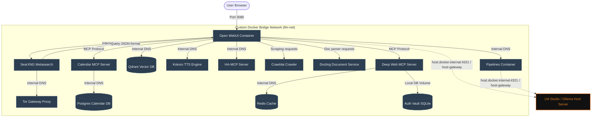

# MasterWebUi: Advanced Local Agentic LLM Workspace

An advanced, defensive microservices architecture that bridges sandboxed container runtimes with local LLM host inference to form a highly integrated, private, and agentic workspace.

This repository orchestrates **Open WebUI** as the core web portal and LLM front-end, integrated with search, text-to-speech, vector memory, database storage, document parsing, web crawlers, telemetry, and custom Model Context Protocol (MCP) servers.

---

## 🏗️ Architecture Overview

The system maintains isolation via a custom Docker bridge network (`llm-net`) while using bridge gateway overrides (`host-gateway`) to route inference calls directly to your host machine's LLM engine (such as LM Studio or Ollama).



---

## 🔥 Key Components

1. **Frontend Orchestrator (Open WebUI)**: Serves as the primary workspace user interface. Handles user management, chat history, prompt templates, and system prompt formatting.
2. **Dynamic Scripting Sandbox (Pipelines)**: Python execution environment for running external filters, custom agents, dynamic valves, and third-party integrations securely.
3. **Privacy Search Gateway (SearXNG)**: Privacy-respecting metasearch engine configured specifically to serve JSON response streams to Open WebUI's RAG pipeline.
4. **Tor Gateway & Crawlers**: Crawl4ai and Docling parsing servers. SearXNG is routed through a SOCKS5 Tor proxy configuration (`tor-gateway`) to provide anonymized deep web lookup capabilities.
5. **Model Context Protocol (MCP) Integration**:
   - **Calendar MCP**: Integrates with PostgreSQL database to schedule and manage events.
   - **HA-MCP**: Home Assistant API connector for smart-home execution.
   - **Deep Web MCP**: Custom SQLite and Redis-cached secure authentication vault.
6. **Vector Search Database (Qdrant)**: High-performance vector database utilized for storing context embeddings during Retrieval-Augmented Generation.
7. **Audio Synthesis (Kokoro-TTS)**: Local, high-quality audio text-to-speech FastAPI container.

---

## 📚 Documentation & Blueprints
To help AI agents and developers easily navigate the repository architecture and past plans, comprehensive documentation is stored in the `docs/blueprints/` directory.

- **System State & Health**: `docs/blueprints/system_state_health_reportV1.md`
- **Architecture Blueprints**: Available within the blueprints directory.

---

## 🚀 Getting Started

### 📋 Prerequisites
- **Docker Desktop** (with Compose capability)
- **LM Studio** or **Ollama** installed on the host OS.

### ⚙️ Step 1: Configuration Setup
1. Copy the environment template:
   ```bash
   cp .env.example .env
   ```
2. Generate secure cryptographic keys in your `.env`:
   - Set `WEBUI_SECRET_KEY` to a random hex string.
   - Set `AES_SECRET_KEY` to a random 256-bit hex string.
   - Fill in your Langfuse API keys if utilizing observability telemetry.

### 🗂️ Step 2: Set SearXNG Permissions
SearXNG runs under an unprivileged user (UID `977`). To prevent permission-denied crashes upon directory volume mount, run the following on your host machine to assign ownership of the SearXNG configuration folder:
- **Linux / macOS**:
  ```bash
  chown -R 977:977 ./data/searxng
  ```
- **Windows (PowerShell)**: *(Handled automatically by Docker volume abstraction layer, but ensure permissions are unrestricted)*.

### 🐳 Step 3: Launch the Stack
Initialize the services sequentially to avoid DNS lookup races:
1. Start the backend infrastructure:
   ```bash
   docker-compose up -d searxng pipelines tor-gateway qdrant postgres redis-cache
   ```
2. Wait a few seconds for DNS tables to bind, then launch the core frontend:
   ```bash
   docker-compose up -d open-webui
   ```

---

## 🛠️ Mandatory Manual Configurations

The following steps cannot be automated programmatically and require manual host configuration:

### 1. Bind Host LLM Inference Server to Wildcard `0.0.0.0`
By default, LM Studio binds exclusively to `127.0.0.1` (localhost). Because Open WebUI runs in an isolated network container, it accesses the host via the `host.docker.internal` gateway. The host OS will refuse the connection unless LM Studio is set to listen on all interfaces.
- **Action**: Open LM Studio -> go to **Local Server** -> change binding port/host to `0.0.0.0`.

### 2. Register Pipelines in Open WebUI Dashboard
To activate Custom Python Pipelines:
- Open Open WebUI (`http://localhost:3080`) in your browser and log in as Admin.
- Navigate to **Admin Panel > Settings > Connections**.
- Under Pipelines, add a connection:
  - **API Host**: `http://pipelines:9099` (Do *not* use localhost)
  - **API Key**: Input the key declared in your `.env` (default: `0p3n-w3bu!`).
- Save the connection.

---

## 🔍 Validation Protocol

Run these validation checks inside your containers to confirm all integrations are working flawlessly:

| Test Target | Validation Command | Expected Result Code | Description |
| :--- | :--- | :--- | :--- |
| **SearXNG API Format** | `docker exec open-webui curl -s -o /dev/null -w "%{http_code}" "http://searxng:8080/search?q=test&format=json"` | `200` | Verifies SearXNG parses JSON API requests correctly. |
| **Host LLM Network** | `docker exec open-webui cat /etc/hosts` | *Host gateway mapping* | Asserts `host.docker.internal` is mapped to the bridge IP. |
| **Pipelines Auth** | `docker exec open-webui curl -s -o /dev/null -w "%{http_code}" -H "Authorization: Bearer 0p3n-w3bu!" http://pipelines:9099/` | `200` | Verifies token authentication works for custom python scripts. |
