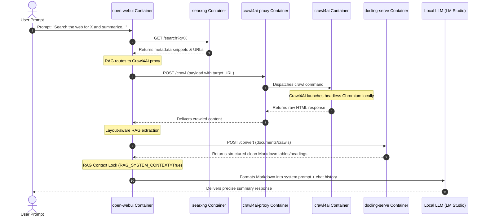
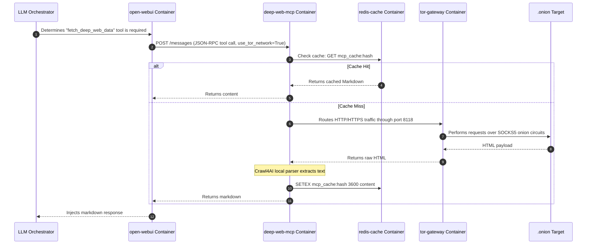

# System State & Functional Health Report

This report provides a deep technical audit of the current local repository, configuration files, and active container architecture for the local LLM laboratory. 

---

## 1. Executive Summary & Convergence Score

The current environment represents a highly scaffolded infrastructure designed for a zero-trust agentic workflow. However, the system is currently **partially broken and unusable from the host** due to critical container port configuration issues and python import errors.

### **Convergence Score: 45% / 100%**
*   **Infrastructure & Persistency (85%)**: All required container nodes are defined, volumes are properly mounted, and core databases/caches are persisted.
*   **Pipeline Configuration (90%)**: The configuration variables for external loaders, engines, and vector stores are fully specified in the `.env` file.
*   **Functional Access (0%)**: The `open-webui` service has no active host port mappings, making the user interface completely inaccessible from outside the Docker bridge network.
*   **MCP Operations (50%)**: `ha-mcp` and `calendar-mcp` are healthy and listening, but `deep-web-mcp` is crash-looping continuously.
*   **Telemetry & Tracing (0%)**: Langfuse tracing is active in the pipelines but points to a non-existent `langfuse-server` container on the network; the Langfuse stack itself is offline.

---

## 2. Active Infrastructure & Port Matrix

The table below catalogs all containers defined in the current deployment, their status, internal/external ports, and volume mounts:

| Service Name | Container Name | Image Target | Ports (Host -> Internal) | Volume Mounts | Network Mode | Status |
| :--- | :--- | :--- | :--- | :--- | :--- | :--- |
| **open-webui** | `open-webui` | `ghcr.io/open-webui/open-webui:main` | None active *(Configured 3080:8080)* | `./data/open-webui:/app/backend/data`, `/sys/fs/cgroup` | `llm-net` (bridge) | **Up (Healthy)** |
| **pipelines** | `pipelines` | `ghcr.io/open-webui/pipelines:main` | None | `./data/pipelines:/app/pipelines` | `llm-net` (bridge) | **Up** |
| **crawl4ai-proxy** | `crawl4ai-proxy` | `ghcr.io/lennyerik/crawl4ai-proxy:latest` | `8000 -> 8000/tcp` | None | `llm-net` (bridge) | **Up** |
| **crawl4ai** | `crawl4ai` | `unclecode/crawl4ai:0.6.0-r2` | None *(Exposes 6379/tcp)* | None | `llm-net` (bridge) | **Up (Healthy)** |
| **docling-serve** | `docling-serve` | `quay.io/docling-project/docling-serve:latest` | `5001 -> 5001/tcp` | None | `llm-net` (bridge) | **Up** |
| **searxng** | `searxng` | `searxng/searxng:latest` | None *(Exposes 8080/tcp)* | `./data/searxng:/etc/searxng` | `llm-net` (bridge) | **Up** |
| **ha-mcp** | `ha-mcp` | `zorak1103/ha-mcp:latest` | None *(Exposes 8080/tcp)* | None | `llm-net` (bridge) | **Up** |
| **calendar-mcp** | `calendar-mcp` | `hdn179/calendar-mcp:latest` | None *(Exposes 8000/tcp)* | `calendar-mcp-data:/app/data` | `llm-net` (bridge) | **Up** |
| **calendar-db** | `calendar-db` | `postgres:15-alpine` | None *(Exposes 5432/tcp)* | `calendar-db-data:/var/lib/postgresql/data` | `llm-net` (bridge) | **Up** |
| **deep-web-mcp** | `deep-web-mcp` | Local build (`./deep-web-mcp`) | None *(Exposes 8000/tcp)* | `./data/deep-web-mcp:/app/data` | `llm-net` (bridge) | **Crash Loop** *(Restarting)* |
| **redis-cache** | `redis-cache` | `redis:alpine` | `6379 -> 6379/tcp` | None | `llm-net` (bridge) | **Up** |
| **tor-gateway** | `tor-gateway` | `dperson/torproxy` | None *(Exposes 8118, 9050, 9051/tcp)* | None | `llm-net` (bridge) | **Up (Healthy)** |
| **browserless** | `browserless` | `browserless/chrome:latest` | None | None | `service:tor-gateway` | **Up** |
| **qdrant** | `qdrant` | `qdrant/qdrant:latest` | None *(Exposes 6333, 6334/tcp)* | `qdrant_data:/qdrant/storage` | `llm-net` (bridge) | **Up** |
| **kokoro-tts** | `kokoro-tts` | `ghcr.io/remsky/kokoro-fastapi-cpu:latest` | None | None | `llm-net` (bridge) | **Up** |

---

## 3. Backend & Frontend Functional Inventory

The components written directly in the host repository expose the following endpoints, tools, and visual boundaries:

### **3.1 Backend Endpoints (FastAPI / FastMCP)**

#### **`deep-web-mcp` (ASGI App generated by FastMCP)**
*   **`/sse` (GET)**: The Server-Sent Events channel where MCP clients (like Open WebUI or Cursor) hook to receive responses.
*   **`/messages` (POST)**: The JSON-RPC message ingestion endpoint. Handles incoming calls to the following tools:
    1.  **`fetch_deep_web_data`**:
        *   **Inputs**: `url` (string, required), `session_required` (boolean, default: `False`), `use_tor_network` (boolean, default: `False`), `js_script` (string, default: `None`).
        *   **Outputs**: JSON structure containing scraping outcome (`status`, `source`, `content`).
        *   **Auth**: Ephemeral token auth via SQLite credential vault (for cookies injection).
    2.  **`search_deep_web_database`**:
        *   **Inputs**: `target_database` (string, required), `search_query` (string, required), `session_required` (boolean, default: `False`), `use_tor_network` (boolean, default: `False`).
        *   **Outputs**: JSON containing query results.
        *   **Auth**: Open access inside the network.

#### **`calendar-mcp` (FastAPI JSON-RPC)**
*   **`/mcp` (GET/POST)**: Handles calendar management.
    *   **Auth**: Requires a Bearer JWT token validated by the secret key: `CALENDAR_MCP_JWT_SECRET_KEY=my_secure_secret_123`.

#### **`ha-mcp` (JSON-RPC)**
*   **`/mcp`** & **`/`**: Internal routing endpoint.
    *   **Auth**: Open access. Exposes 28 tools for home-assistant registry, states, automation config patches, scenes, camera stream triggers, HACS control, and system log extraction.

### **3.2 Frontend UI Screens (Open WebUI Container)**
*   **Landing / Chat Screen**: Handles prompt input and displays formatted RAG text.
*   **Workspace Settings**:
    *   **Workspace -> Tools**: Where `run_code.py` (cgroups sandboxed Python execution) and `youtube-transcript-provider.py` must be registered.
    *   **Workspace -> Pipelines**: Handles initialization of `comfy-mcp-pipeline.py` (Stdio-based image generator running `uvx comfy-mcp-server`) and `langfuse_filter_pipeline.py` (telemetry/tracing).
*   **Admin Panel**: Core configuration manager containing Ollama connection, authentication trusts, and RAG configuration.

---

## 4. Pipeline Data Flow Analysis

This section tracks how search, crawl, and parse events move through the isolated Docker network:

### **Workflow: RAG Web Search & Scrape Pipeline**

### **Workflow: Deep Web / Dark Web Query Pipeline (MCP)**

---

## 5. Architectural Anomalies & Technical Debt

The following table lists the physical configuration failures, broken integrations, and code errors discovered during the audit:

| Severity | Target Component | File / Resource | Symptom / Error | Impact | Recommendation |
| :--- | :--- | :--- | :--- | :--- | :--- |
| **CRITICAL** | Host Port | [docker-compose.yml](file:///c:/open-webui-master/docker-compose.yml#L85-L86) | `open-webui` maps `3080:8080` in manifest, but is not bound on the host. `HostConfig` lists `{invalid IP 3080}`. | The frontend UI is completely unreachable from the host browser. | Recreate the container with `docker compose up -d --force-recreate open-webui` to trigger a clean port map binding. |
| **CRITICAL** | MCP Server | [deep-web-mcp/server.py](file:///c:/open-webui-master/deep-web-mcp/server.py#L12) | `ModuleNotFoundError: No module named 'langfuse.decorators'` | The container is crash-looping continuously and is unusable. | Change the import statement in `server.py` to `from langfuse import observe, langfuse_context` (standard for Langfuse SDK v3+). |
| **HIGH** | Telemetry | [.env](file:///c:/open-webui-master/.env#L27) | `LANGFUSE_HOST` points to `http://langfuse-server:3000` but no such host or container is active. | Open WebUI and pipelines fail to log traces, throwing network timeout errors. | Deploy the Langfuse stack (`docker compose -f langfuse.yml up -d`) and adjust hostnames accordingly. |
| **MEDIUM** | Network Routing | [docker-compose.yml](file:///c:/open-webui-master/docker-compose.yml#L24-L39) | `crawl4ai` container does not route through `tor-gateway` for general Open WebUI crawler requests. | Standard RAG scrapes are done in the clear (revealing host IP address to target domains). | Run `crawl4ai` in network namespace of `tor-gateway` or specify SOCKS5 routing config. |
| **LOW** | Config Syntax | [docker-compose.yml](file:///c:/open-webui-master/docker-compose.yml#L32-L39) | `crawl4ai-proxy` lacks `CRAWL4AI_ENDPOINT` environment variable. | May fail to resolve crawling endpoint if fallback logic is absent. | Explicitly define `CRAWL4AI_ENDPOINT: http://crawl4ai:6379/crawl` (or appropriate port) in compose file. |
