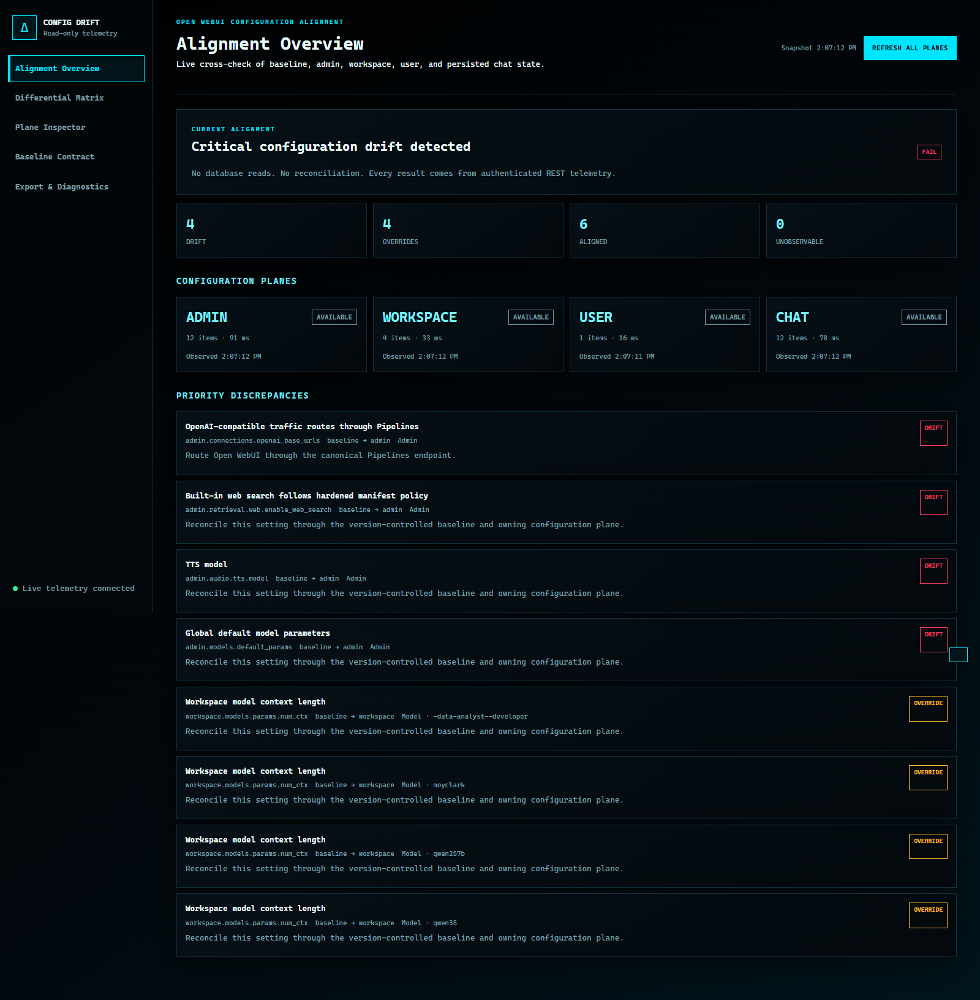

# Configuration Drift Monitor Validation

Date: 2026-06-11  
Target: `http://127.0.0.1:19100/`

## Decision

- **Monitor implementation and rollout: PASS**
- **Observed Open WebUI configuration alignment: FAIL**

The standalone read-only monitor is deployed, healthy, and verified. It correctly reports critical live configuration drift. No reconciliation or Open WebUI configuration changes were performed.

## Delivered

- FastAPI/Uvicorn/Pydantic/PyYAML service using one shared asynchronous `httpx` client.
- Independently scheduled REST pollers for Admin, Workspace Models, Users, and recent persisted Chat Controls.
- Version-controlled YAML baseline with hardened-Compose precedence, JSON-pointer mappings, comparison modes, selectors, and allowlists.
- Sanitized in-memory differential engine with stale-plane handling and no database access.
- Typed health, overview, snapshot, diff, baseline, SSE, refresh, and Markdown/JSON export APIs.
- Modular no-build OLED/cyan UI with overview, matrix filters, plane inspector, baseline view, diagnostics, tooltips, copy actions, SSE, and fallback refresh.
- Hardened local-only container definition and a source-level link from the Web Tools Control Center.

## Live Alignment Findings

Current posture: **FAIL**

| Status | Count |
| --- | ---: |
| Aligned | 6 |
| Drift | 4 |
| Override | 4 |
| Unavailable | 0 |
| Unobservable | 0 |

Critical drift:

1. Pipelines route expected `http://pipelines:9099/v1`; Admin runtime reports `http://host.docker.internal:4321/v1`.
2. Hardened baseline expects built-in web search disabled; Admin runtime reports it enabled.

Warning drift and overrides:

1. TTS model expected `kokoro`; runtime reports `tts-1-hd`.
2. Global default model parameters expect `options.num_ctx=16000`; runtime reports no global defaults.
3. Four workspace models do not expose the expected `num_ctx=16000` setting: `-data-analyst--developer`, `moyclark`, `qwen257b`, and `qwen35`.

All four telemetry planes were available during validation:

- Admin: 12 endpoint payloads
- Workspace: 4 models
- User: 1 registered user
- Chat: 12 qualifying recent persisted chats

## Verification Evidence

- Full test suite: **82 passed, 3 skipped**
- Focused monitor suite: **9 passed**
- Python syntax: **PASS**
- JavaScript syntax: **PASS**
- Compose validation: **PASS** with validation-only values supplied for the hardened manifest's required environment variables
- `git diff --check`: **PASS**
- Offline image build using `docker build --network=none`: **PASS**
- Manual read-only refresh rate limit: first request `200`, immediate second request `429`
- Browser verification: 14 matrix rows, 4 drift rows, 4 plane inspectors, 2 export links, SSE connected, zero console errors
- JSON and Markdown exports: **PASS**
- Export privacy scan: zero email-value matches and zero credential/token-value matches
- Service log scan: zero error, traceback, exception, or HTTP 500 lines

## Runtime Hardening

- Local-only ingress: `127.0.0.1:19100`
- Network: `open-webui-master_llm-net`
- Memory limit: 512 MiB
- Observed memory: approximately 43 MiB
- CPU limit: 1 CPU
- Observed CPU snapshot: approximately 0.14%
- PID limit: 64; observed: 15
- Read-only root filesystem: enabled
- Linux capabilities: all dropped
- `no-new-privileges`: enabled
- GPU device requests: none
- Mounts: one read-only baseline bind mount
- Forbidden runtime packages such as Torch, sentence-transformers, Qdrant, Redis, and SQLAlchemy: absent

Only `config-drift-monitor` was replaced during rollout. Open WebUI was not restarted or modified. The Control Center link is implemented in source and will become live during its next planned monitor-daemon rollout.

## Privacy And Read-Only Proof

- The Open WebUI telemetry client exposes GET only; tests reject POST, PUT, PATCH, and DELETE calls.
- User labels exclude email addresses.
- Chat telemetry retains only ID suffix, update time, model IDs, sanitized parameters, and system fingerprint.
- Messages, history, files, titles, prompts, credentials, cookies, authenticated URL components, and API keys are discarded, fingerprinted, or redacted before state storage and export.
- The service has no database integration, Docker socket, configuration-write operation, GPU request, or reconciliation control.

## Rendered UI

## Residual Action

The monitor is operating correctly. Alignment remains failed until the owning configuration planes intentionally reconcile or baseline-allowlist the two critical drifts and six warning-level mismatches/overrides.
