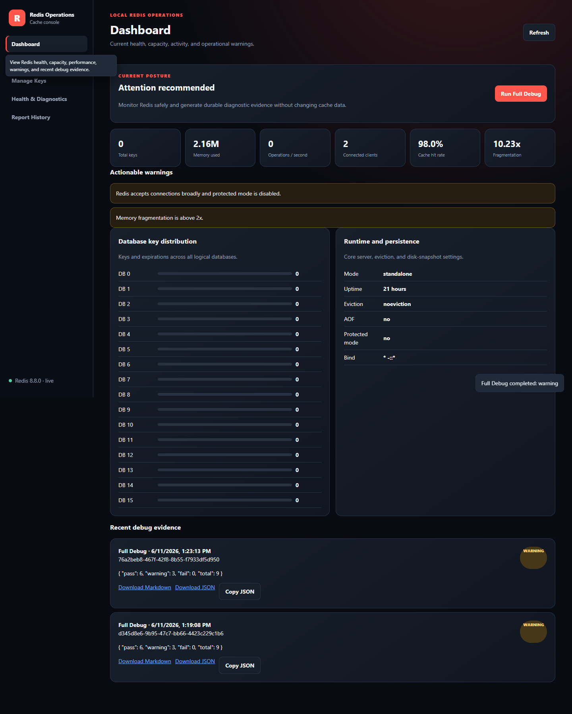

# Redis Operations Console Upgrade Validation

Date: 2026-06-11  
Target: `http://127.0.0.1:5540/`  
Decision: **PASS**

## Result

The Redis UI was upgraded and deployed as a modular local operations console. The live console provides a clear dashboard, read-only key browsing, separated advanced key management, a one-click read-only Full Debug workflow, and persistent downloadable report history.

The live Full Debug result is **WARNING**, not failure. The console correctly identifies:

- Redis accepts connections broadly and protected mode is disabled.
- Memory fragmentation is above 2x.

No Redis configuration was automatically changed.

## Delivered

- Modular no-build HTML, CSS, and JavaScript UI.
- Dashboard, Browse Keys, Manage Keys, Health & Diagnostics, and Report History navigation.
- Accessible hover and keyboard-focus tooltips.
- Confirmations for create/replace and delete operations.
- Versioned typed overview and debug-report APIs.
- Cached/coalesced overview probes with SSE updates and 60-second UI fallback.
- Strictly read-only Full Debug checks covering connectivity, runtime, memory, persistence, clients, performance, modules, security, and metadata-only keyspace inventory.
- SQLite report persistence on the `redis-ui-data:/app/data` Docker volume.
- 30-day and 200-report retention controls, artifact caps, and credential redaction.
- Markdown and JSON report downloads.
- Existing `/api/*` management routes preserved.

## Verification Evidence

### Automated gates

- `pytest -q`: **73 passed, 3 skipped**
- Python syntax checks: **PASS**
- JavaScript syntax check: **PASS**
- `docker compose --profile offline-tools config --quiet`: **PASS**
- `docker build --network=none -f services/redis-ui/Dockerfile -t redis-ui:local .`: **PASS**
- `git diff --check`: **PASS**

### Live API and data-safety checks

- Recreated only `redis-ui`, preserving `redis://redis-cache:6379/0`, `127.0.0.1:5540`, and the existing Redis network.
- Created, browsed, inspected, and deleted a temporary namespaced validation key.
- Confirmed the temporary key was removed.
- Ran live Full Debug: **9 checks**, overall **WARNING**, no failures.
- Downloaded Markdown and JSON report formats.
- Confirmed neither report contained the temporary key name or value.
- Restarted `redis-ui` and confirmed report history persisted.
- Confirmed the named volume is mounted at `/app/data`.

### Rendered UI checks

- Page title: `Redis Operations Console`
- Navigation labels: Dashboard, Browse Keys, Manage Keys, Health & Diagnostics, Report History
- Diagnostics tooltip rendered on hover.
- Full Debug ran from the rendered UI and displayed all 9 checks.
- Report History displayed retained reports and both download actions.
- Manage Keys rendered both create/replace and delete confirmations; a temporary UI-created key was browsed and then removed.
- Browser console errors: **0**
- Container application errors/tracebacks after rollout: **0**

## Screenshot

## Residual Warnings

Redis currently has broad binding/protected-mode and high-fragmentation warnings. These are intentionally diagnosed with remediation guidance but were not automatically changed, matching the approved safety scope.
