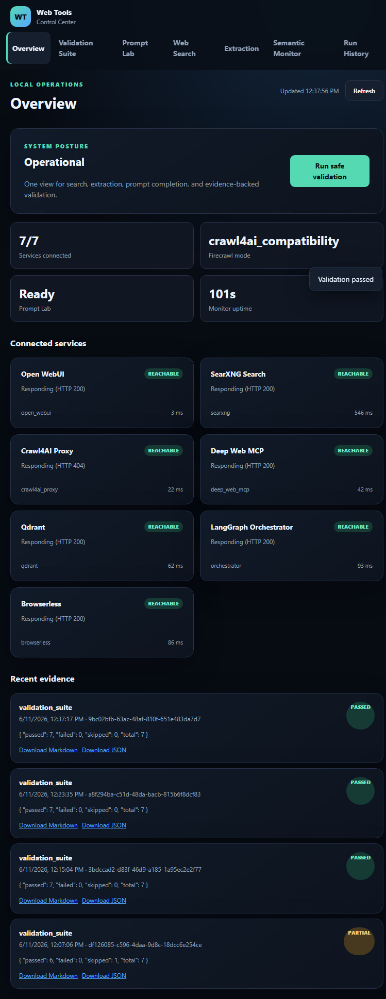

# Web Tools Control Center Upgrade Validation

Date: 2026-06-11  
Target: `http://127.0.0.1:19000/`  
Decision: **PASS - GO**

## Outcome

The Web Tools Control Center upgrade is implemented, deployed, and verified
end-to-end. The live UI is Operational with 7 of 7 services reachable, Prompt
Lab Ready, durable run evidence, and no browser-console or service-log errors.

## Final Live Validation

Final rendered-UI validation run:
`9bc02bfb-63ac-48af-810f-651e483da7d7`

- Result: **passed**
- Passed: 7
- Failed: 0
- Skipped: 0
- Service connectivity: 7 of 7 reachable
- Real SearXNG search: passed
- Deep Web MCP search: passed
- Deep Web MCP extraction: passed
- Crawl4AI extraction: passed
- Firecrawl compatibility verification: passed
- Real Open WebUI Qwen3.5 prompt completion: passed

The final run remained the latest passed run after a `monitor-daemon` restart.
Prompt Lab also remained ready with 12 models visible after restart.

## Rendered UI Verification

The final deployed UI was exercised through a rendered Chromium target:

- One-click validation suite: passed
- Prompt Lab real completion: passed
- Web Search: returned 8 rendered results
- Deep Web MCP extraction: passed
- Crawl4AI extraction: passed
- Firecrawl compatibility extraction: passed
- Run History: displayed passed durable runs
- Structured result tabs: Rendered, Raw JSON, and Metadata present
- Copy and download actions: present
- Browser console errors: **0**

## Implementation Verification

- Modular no-build UI served from `monitor_ui/`
- Maintainable support package in `monitor_app/`
- Existing `/web-tools/*` and `/monitor/*` routes retained
- Typed versioned OpenAPI response contracts present
- SSE update endpoint operational
- Probe cache/coalescing enabled with 15-second TTL
- Shared public-target SSRF protection enabled
- SQLite run history stored on `monitor-daemon-data:/app/data`
- 30-day / 500-run retention, artifact caps, and credential redaction enabled
- Markdown and JSON run exports return HTTP 200
- Open WebUI API-key authentication enabled; credential remains server-side
- Qdrant alias `canon_master_space` and live integration URLs preserved

## Required Gates

- Full `pytest`: **70 passed, 3 skipped**
- Focused control-center and Deep Web MCP tests: passed
- `docker build --network=none -f Dockerfile.monitor`: passed
- Docker Compose validation: passed
- `node --check monitor_ui/app.js`: passed
- `git diff --check`: passed
- Post-restart service logs: clean
- Final browser console: clean

## Final Decision

**PASS - GO.** The planned Web Tools Control Center upgrade is live and all
required implementation, real-tool, prompt-completion, persistence, browser,
build, and test gates have passed.
