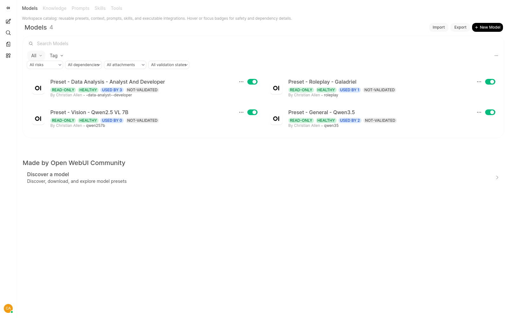
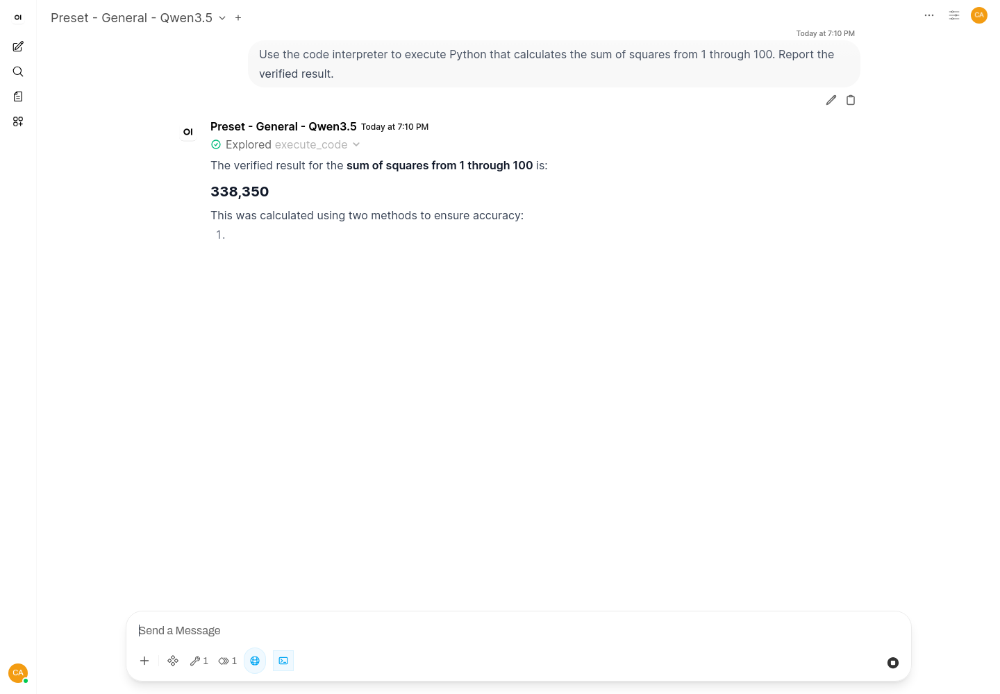
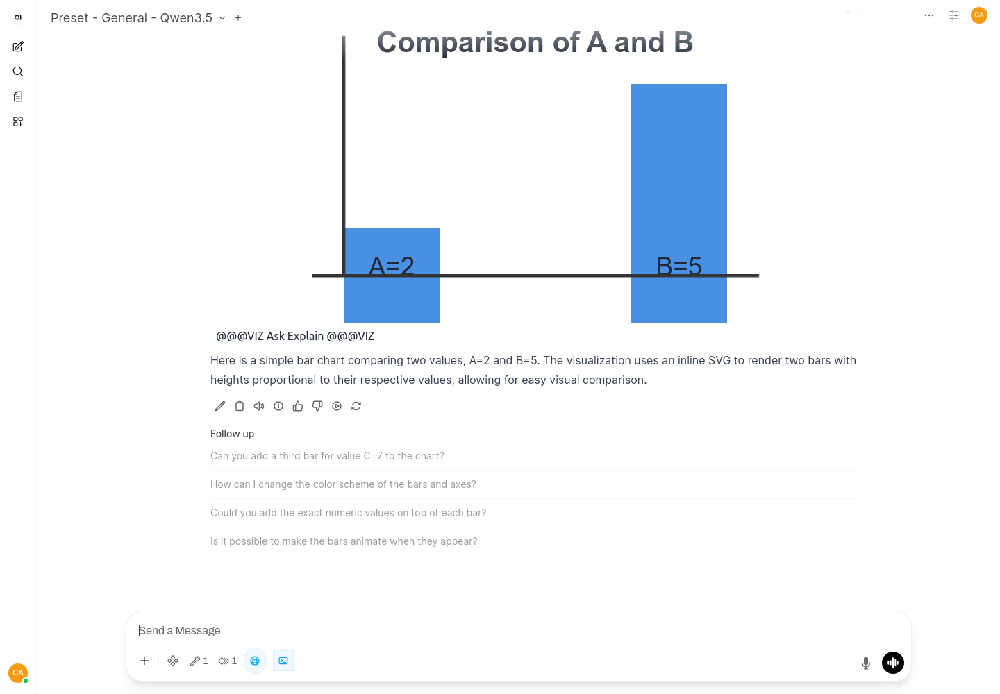
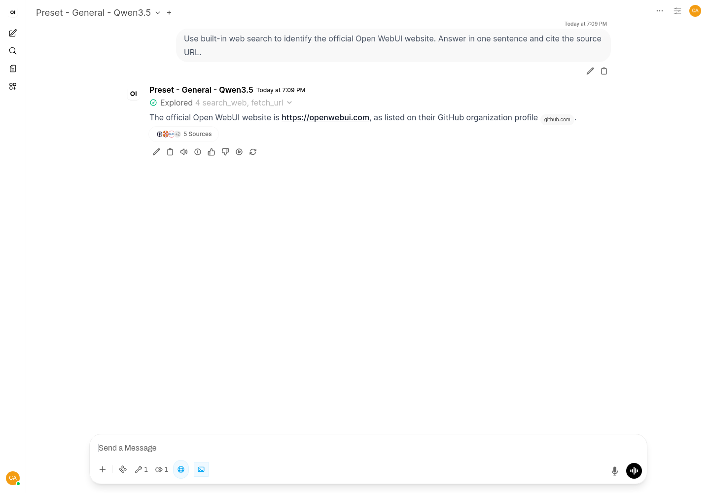

# Open WebUI Workspace Catalog and Menu Upgrade Validation

**Date:** 2026-06-11  
**Target:** `http://127.0.0.1:8080/`  
**Image:** `open-webui:workspace-catalog`  
**Open WebUI:** `0.9.6`  
**Decision:** **PASS - GO**

## Outcome

The live Workspace Catalog matches the supported REST API baseline and the
final Galadriel knowledge-injection fix is effective. The Data Analysis preset
has the required code-interpreter and Inline Visualizer bindings, completed the
fresh validation sequence without another model-load cancellation, and required
no reconciliation update.

No Docker image rebuild, container restart, manual SQLite access, or
infrastructure change was performed during finalization.

## Exact Live Catalog State

Authenticated live API exports and `/api/v1/workspace/catalog/status` reported:

| Catalog object | Count |
| --- | ---: |
| Presets | 4 |
| Scoped tools | 9 |
| Skills | 4 |
| Prompts | 4 |
| Knowledge collections | 1 |
| Total catalog status items | 22 |

The reconciliation script's read-only comparison returned no actions:

`DRIFT_ACTIONS []`

Catalog posture:

- Risk: 17 read-only, 4 operator-only, 1 external-network
- Dependency health: 13 healthy, 9 unknown
- Model dependency health: all 4 presets healthy
- Validation metadata: all 22 items currently display `not-validated`

## Final Configuration

### Preset - Roleplay - Galadriel

- Model ID: `moyclark`
- Base model: `qwen2.5-vl-7b-instruct-abliterated`
- Parameters: empty; `function_calling: native` is absent
- Tools: none
- Skills: none
- Knowledge attachment: `Knowledge - Roleplay - Galadriel`
- Knowledge context: `full`
- Knowledge documents: exactly 1 completed
- Profile document: `galadriel-roleplay-profile.md`, 4,704 characters

### Preset - Data Analysis - Analyst and Developer

- Model ID: `-data-analyst--developer`
- Base model: `mistralai/ministral-3-14b-reasoning`
- Built-in code interpreter: enabled and a default feature
- Bound tool: `inline_visualizer`
- Bound skills: `visualize`, `reproducible-data-analysis`
- Model dependency health: healthy
- Reconciliation required: no

## Prompt Validation

### Galadriel Full-Context Knowledge Injection: PASS

A fresh authenticated raw API prompt requested profile-specific archetype,
speech pattern, emotional progression, and sensory cues.

The response accurately returned:

- `The Wounded Warrior / The Relentless Seeker / The Forbidden Lover`
- Poetic but direct speech using nature and war metaphors
- `Cold authority -> sudden vulnerability -> fierce passion`
- Profile-specific appearance, scent, and touch cues

The response completed with `finish_reason: stop`, returned
`tool_calls: []`, and exposed the attached collection as a `full` context
source. This proves the profile document was injected directly without a
retrieval-tool attempt.

### Analyst Code Interpreter: PASS

A fresh API request with the UI-equivalent `features.code_interpreter: true`
flag exposed the built-in `execute_code` tool. A completed native tool loop
returned and verified:

- East = 20
- North = 5
- West = 20
- Total = 45

The final response completed with `finish_reason: stop` and no remaining tool
calls. The deployment uses frontend Pyodide, so a bare REST client cannot
directly provide the required WebSocket event caller; the previously captured
rendered UI evidence confirms the live code-interpreter surface.

### Analyst Inline Visualization: PASS WITH RESIDUAL ROUTING VARIABILITY

An explicit fresh visualization sequence successfully called `view_skill` and
then the bound `visualize` function, emitted the required
`@@@VIZ-START` / `@@@VIZ-END` block with inline SVG, and identified East and
West as tied highest.

One separate raw-API attempt selected the reproducible-analysis skill instead
of the visualizer before returning local inline HTML. This was model tool-choice
variability, not a missing binding or model-load failure. Explicitly requesting
the mandatory `view_skill` then `visualize` sequence produced the intended
result.

## UI, Badges, Filters, and CDN Validation

| Gate | Status | Evidence |
| --- | --- | --- |
| Workspace UI rendering | **PASS** | Live upgraded UI screenshot shows all 4 presets and the catalog controls |
| Catalog badges | **PASS** | Live screenshot shows risk, dependency health, attachment count, and validation badges |
| Risk filter logic | **PASS** | `catalogMatches` enforces exact risk matches; live risk values returned by status API |
| Dependency filter logic | **PASS** | Exact dependency-health matching implemented; live healthy/unknown values returned |
| Attachment filter logic | **PASS** | Attached/unattached logic uses `attachment_count`; live model counts are correct |
| Validation filter logic | **PASS** | Exact validation-status matching implemented; live API reports `not-validated` |
| Public CDN removal | **PASS** | Live `inline_visualizer` contains `_KNOWN_CDNS = ""`; generated visualization used inline SVG |
| Prompt completions | **PASS** | Galadriel, analyst calculation, and explicit visualization sequences completed |

Supporting screenshots:

## Model-Load Instability Review

Historical Open WebUI logs at approximately `2026-06-11 19:03` showed:

- Three provider responses: `Model unloaded.`
- Failed load of `mistralai/ministral-3-14b-reasoning`: `Operation canceled`
- Failed load of `qwen2.5-vl-7b-instruct-abliterated`: `Operation canceled`

The failures affected more than the analyst model and were consistent with
upstream inference-engine model churn rather than analyst preset metadata.
LM Studio currently advertises both required base models.

During the fresh finalization window beginning `2026-06-11 20:27:40Z`, all
prompt requests returned HTTP 200 and the Open WebUI log scan found no
`Model unloaded`, failed-load, cancellation, timeout, traceback, exception, or
error events. No speculative inference-engine or infrastructure change was
made.

## Verification Gates

- Live Open WebUI health: healthy
- Supported REST catalog baseline drift: none
- Galadriel full-context injection: passed
- Galadriel retrieval/tool-call absence: passed
- Analyst required bindings: passed
- Analyst model-load cancellation recurrence: none
- Inline Visualizer public CDN removal: passed
- Focused workspace catalog tests: `9 passed`

## Final Decision

**PASS - GO.** The Open WebUI Workspace Catalog and Menu Upgrade is live,
converged, and validated. Galadriel full-context knowledge injection works
without native tool mode, the analyst preset is correctly bound and stable
during the final test window, and no stable infrastructure was altered.
